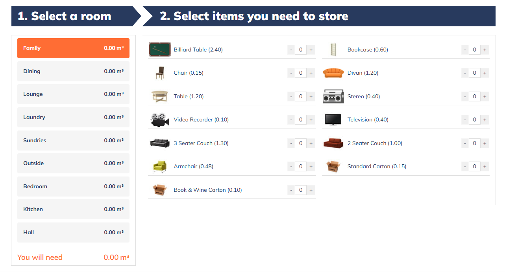

# Space Estimator Calculator WordPress Plugin

A comprehensive WordPress plugin that helps users calculate storage space requirements for moving or storage purposes. This plugin provides an interactive calculator interface where users can select rooms and items to estimate the total space needed.



## 🚀 Features

- **Interactive Calculator Interface**: Modern, responsive design with step-by-step guidance
- **Room Management**: Create and manage different room types (Family, Dining, Lounge, etc.)
- **Item Management**: Add items with space values and assign them to specific rooms
- **Image Support**: Upload images for items to provide visual context
- **Real-time Calculations**: Dynamic space calculation as users select items
- **Shortcode Integration**: Easy embedding with `[space_estimator]` shortcode
- **Admin Dashboard**: Complete CRUD operations for rooms and items
- **AJAX Functionality**: Smooth user experience with dynamic content loading
- **Responsive Design**: Works perfectly on desktop, tablet, and mobile devices
- **Default Data**: Comes pre-loaded with common rooms and items

## 📋 Requirements

- WordPress 6.0 or higher
- PHP 7.4 or higher
- Modern web browser with JavaScript enabled

## 🔧 Installation

### Method 1: Manual Installation
1. Download the plugin files from this repository
2. Upload the `space-estimator-calculator` folder to your WordPress `/wp-content/plugins/` directory
3. Activate the plugin through the 'Plugins' menu in WordPress admin
4. The plugin will automatically create default rooms and items upon activation

### Method 2: WordPress Admin Upload
1. Go to WordPress Admin → Plugins → Add New
2. Click "Upload Plugin"
3. Choose the plugin zip file and upload
4. Activate the plugin

## 🎯 How to Use

### For Website Visitors

1. **Access the Calculator**: The calculator appears wherever you've added the `[space_estimator]` shortcode
2. **Select a Room**: Choose from available rooms (Family, Dining, Lounge, etc.)
3. **Choose Items**: Select items you need to store and specify quantities
4. **View Results**: See the total space calculation in real-time

### For Website Administrators

#### Managing Rooms
1. Go to **Space Estimator → Rooms** in WordPress admin
2. Click "Add New Room" to create custom rooms
3. Set default space values for each room
4. Edit or delete existing rooms as needed

#### Managing Items
1. Go to **Space Estimator → Items** in WordPress admin
2. Click "Add New Item" to create new items
3. Set space value (in cubic meters) for each item
4. Assign items to specific rooms
5. Upload images for better visual representation
6. Edit or delete items as needed

#### Settings Configuration
1. Go to **Space Estimator → Settings**
2. Configure unit labels and symbols
3. Customize the display format

## 📱 Shortcode Usage

### Basic Usage
```
[space_estimator]
```

### With Pre-selected Room
```
[space_estimator room="123"]
```
Replace `123` with the actual room ID.

## 🎨 Customization

### Styling
The plugin includes comprehensive CSS that can be customized:
- Main styles: `assets/css/style.css`
- Admin styles: `assets/css/admin.css`

### Default Rooms Included
- Family Room
- Dining Room
- Lounge (with default 3.25 m³ space)
- Laundry Room
- Sundries Room
- Outside Area
- Bedroom
- Kitchen
- Hall

### Default Items (Lounge Category)
- Bar (1.00 m³)
- Bookshelf (0.50 m³)
- Bureau (0.60 m³)
- Chair Arm (0.80 m³)
- Chair Other (0.30 m³)
- China Cabinet (0.70 m³)
- Coffee Table (0.20 m³)
- Desk (0.85 m³)
- Divan (1.20 m³)
- Heater (1.00 m³)
- Lampshade (0.20 m³)
- Organ (2.00 m³)
- Piano (2.00 m³)
- Stereo (0.40 m³)
- TV (0.40 m³)
- Video Recorder (0.10 m³)
- Wall Unit (1.00 m³)
- Standard Carton (0.15 m³)
- Book & Wine Carton (0.10 m³)

## 🔧 Technical Details

### File Structure
```
space-estimator-calculator/
├── space-estimator-calculator.php (Main plugin file)
├── assets/
│   ├── css/
│   │   ├── style.css (Frontend styles)
│   │   └── admin.css (Admin styles)
│   ├── js/
│   │   ├── script.js (Frontend functionality)
│   │   └── admin.js (Admin functionality)
│   └── screenshot.png (Plugin screenshot)
└── README.md (This file)
```

### Database Tables
The plugin uses WordPress custom post types:
- `room` post type for room management
- `item` post type for item management
- Custom meta fields for space values and relationships

### AJAX Endpoints
- `get_items_by_room`: Retrieves items for selected room
- `delete_item`: Removes items from admin
- `delete_room`: Removes rooms and associated items

## 🛠️ Development

### Hooks and Filters
The plugin follows WordPress coding standards and includes:
- Proper nonce verification for security
- Internationalization support
- WordPress coding standards compliance
- Error handling and validation

### Browser Support
- Chrome (latest)
- Firefox (latest)
- Safari (latest)
- Edge (latest)
- Internet Explorer 11+

## 📞 Support

For support, feature requests, or bug reports, please:
1. Check the existing issues on GitHub
2. Create a new issue with detailed description
3. Include WordPress version, PHP version, and plugin version

## 📄 License

This plugin is licensed under the GPL v2 or later.

## 🤝 Contributing

Contributions are welcome! Please:
1. Fork the repository
2. Create a feature branch
3. Make your changes
4. Test thoroughly
5. Submit a pull request

## 📝 Changelog

### Version 1.0.0
- Initial release
- Complete room and item management
- Interactive calculator interface
- Admin dashboard
- Image upload support
- AJAX functionality
- Responsive design
- Shortcode integration
- Default data included

---

**Author**: Anurag Singh  
**Website**: https://anuragsingk.com  
**Plugin URI**: https://nubevest.com.au/

Made with ❤️ for the WordPress community
